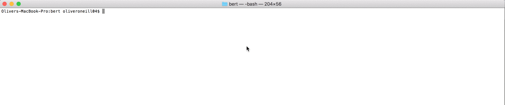

# bert

[](https://greenkeeper.io/)

[](https://travis-ci.org/oliveroneill/bert)

Bert (Better Error Resolution in Terminals) is a program that will monitor your terminal output and send you
helpful tips on how to solve errors.

This is still a work in progress. Currently Bert can identify basic
errors and will send you a notification with a link to the StackOverflow
search results. We have plans to extend this functionality to deliver
helpful answers and identify a large range of tests.



## Install
Currently the project is not available on `npm` yet, as its still in
development and we'd like to wait until it can handle a greater
spectrum of errors. See the [development section](#development) below for how
to install manually.

## Running
Run in your terminal:
```bash
bert
```
This will then start your `bert` session and any errors that appear
in your terminal will trigger `bert` to send you notifications which
allow you to quickly find a solution.

## OS Support
Currently only tested on MacOS. It should run fine on Linux. Unfortunately we
are using `script` to watch terminal output and I don't believe this is
included in Windows, we plan to add support in the future.

## Development
Install:
```bash
npm i
```
Build the package (currently used for [Flow](https://flow.org/)):
```bash
npm run build
```
Link the package so that you don't have to re-install each time:
```bash
npm link
```
Test:
```bash
npm test
```
Run:
```bash
bert
```

## TODO
- Add better search functionality so that Bert can give real recommendations
- Windows compatibility
- More error identifiers. Consider looking at [VSCode problem matchers](https://code.visualstudio.com/updates/v1_11#_tasks)
